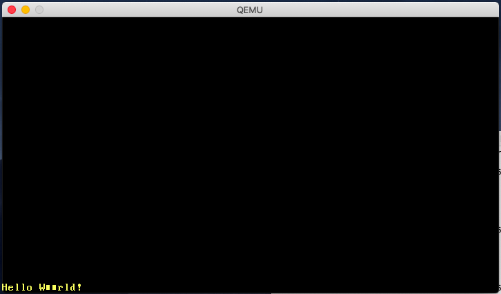

# VGA Text Mode

VGAテキストモードは、テキストをスクリーンにPrintするための簡単な方法です。
この記事では、安全でないものを安全なものにするために、私達はインターフェースを安全でシンプルなものとして作り、安全でないものはすべて個別のモジュールにカプセル化して作る。

This blog is openly developed on GitHub. If you have any problems or questions, please open an issue there. You can also leave comments at the bottom. The complete source code for this post can be found here.


## The VGA Text Buffer


VGAテキストモードで画面に文字をPrintするには、VGAハードウェアのテキストバッファに書き込む必要があります。VGAテキストバッファは通常25行80列の2次元配列で、画面に直接表示されます。各配列項目は、次の形式で一つのScreen Charractor(画面文字)を描画します。

<table><thead><tr><th>Bit(s) </th><th> Value</th></tr></thead><tbody>
<tr><td>0-7    </td><td> ASCII code point</td></tr>
<tr><td>8-11   </td><td> Foreground color</td></tr>
<tr><td>12-14  </td><td> Background color</td></tr>
<tr><td>15     </td><td> Blink</td></tr>
</tbody></table>

ちなみに次の色が使える。

<table><thead><tr><th>Number </th><th> Color      </th><th> Number + Bright Bit </th><th> Bright Color</th></tr></thead><tbody>
<tr><td>0x0    </td><td> Black      </td><td> 0x8                 </td><td> Dark Gray</td></tr>
<tr><td>0x1    </td><td> Blue       </td><td> 0x9                 </td><td> Light Blue</td></tr>
<tr><td>0x2    </td><td> Green      </td><td> 0xa                 </td><td> Light Green</td></tr>
<tr><td>0x3    </td><td> Cyan       </td><td> 0xb                 </td><td> Light Cyan</td></tr>
<tr><td>0x4    </td><td> Red        </td><td> 0xc                 </td><td> Light Red</td></tr>
<tr><td>0x5    </td><td> Magenta    </td><td> 0xd                 </td><td> Pink</td></tr>
<tr><td>0x6    </td><td> Brown      </td><td> 0xe                 </td><td> Yellow</td></tr>
<tr><td>0x7    </td><td> Light Gray </td><td> 0xf                 </td><td> White</td></tr>
</tbody></table>

4ビット目はBright Bitと呼ばれ、明るさを表す。
例えば、Blue(0x1=0001b)の4bitが1になるとLight Blue(0x9=1001b)になる。

VGAテキストバッファはアドレス`0xb8000`へのMemory-mapped I/Oを介して、アクセス可能である。
つまり、そのアドレスへの読み書きはRAMにはアクセスせず、VGAハードウェア上のテキストバッファに直接アクセスする。
これは、通常のメモリ操作でそのアドレスに対して読み書きできることを意味する。
(要はメインメモリとは分離したアドレス空間にある)

ひとつ注意になるが、
Memory-mappedなハードウェアは通常のRAM操作(RAM operations)をすべてサポートしているわけではない。
例えば、あるデバイスでは、u64がreadされたときにバイト単位のreadとジャンクを返すことのみサポートしている。
幸い、テキストバッファは通常のread/writeをサポートしているので特別なことはありませんが。


### A Rust Module

VGAバッファの動作がわかったし、画面表示操作のRust moduleを作っていくぞ。

```rs
//in src main.rs

mod vga_buffer;
```

このvga_bufferモジュールのために、`src/vga_buffer.rs`ファイルを新たに作成します。
以降のコードは、特に指定がない限りこのモジュールに入ります。

### Colors

まずはじめに、異なる色をEnum型で表現する。

```rs
// in src/vga_buffer.rs

#[allow(dead_code)]
#[derive(Debug, Clone, Copy, PartialEq, Eq)]
#[repr(u8)]
pub enum Color {
    Black = 0,
    Blue = 1,
    Green = 2,
    Cyan = 3,
    Red = 4,
    Magenta = 5,
    Brown = 6,
    LightGray = 7,
    DarkGray = 8,
    LightBlue = 9,
    LightGreen = 10,
    LightCyan = 11,
    LightRed = 12,
    Pink = 13,
    Yellow = 14,
    White = 15,
}

```

C言語のような感じで、enum(列挙型)を使用して各色の数値を明示的にしてする。
repr(u8)アトリビュートのため、各enumバリアントはu8として格納されます。
実際には、4bitでサイズ的には十分ですが、Rustにはu4タイプはありません。
(バリアント≒入力値セット のような意味合い)

通常、コンパイラは未使用の各バリアントごとに警告を発行する。
なので上記コードでも未使用のdead_codeの警告が通常なら発行されるが、`#[allow (dead_code)]`アトリビュートを使用することによって、Color列挙体に対するdead_codeの警告を無効化できる。

また、Copy、Clone,Debug、PartialEq,およびEqトレイトで、
Color型に対してのCopyセマンティクスを有効にし、そしてprint可能と同等になる。
(printable and comprableのうまい訳がよくわからない)

前面色と背面色を指定するフルカラーコードを表すために、u8にnewtypeを作成します。

```rs
// in src/vga_buffer.rs

#[derive(Debug, Clone, Copy, PartialEq, Eq)]
struct ColorCode(u8);

impl ColorCode {
    fn new(foreground: Color, background: Color) -> ColorCode {
        ColorCode((background as u8) << 4 | (foreground as u8))
    }
}
```

ColorCodeは、前面色と背面色のフルカラーバイトを含む。
Like before, we derive the Copy and Debug traits for it.

## Text Buffer

これで、スクリーン文字とテキストバッファを表すための構造を追加できるようになった。


```rs
// in src/vga_buffer.rs

#[derive(Debug, Clone, Copy, PartialEq, Eq)]
#[repr(C)]
struct ScreenChar {
    ascii_character: u8,
    color_code: ColorCode,
}

const BUFFER_HEIGHT: usize = 25;
const BUFFER_WIDTH: usize = 80;

struct Buffer {
    chars: [[ScreenChar; BUFFER_WIDTH]; BUFFER_HEIGHT],
}
```

デフォルトの構造体でのフィールドのオーダー(順序)はRustでは未定義なので、repr(C)アトリビュートが必要になる。
これは、Rustの構造体フィールドがCの構造体フィールドと同じようにレイアウトされることを保証するため、フィールドの順序付けが保証される。

それじゃ、実際に画面に描画するために、writer typeを作る。

```rs
// in src/vga_buffer.rs

pub struct Writer {
    column_position: usize,
    color_code: ColorCode,
    buffer: &'static mut Buffer,
}

```

ライターは常に最後の行に書き込み、そして行が満杯(または、\nがオン)になると行を、上にシフトする。
columun_positionフィールドは、最後の行の現在位置を追跡する。
現在の前面色と背面色はcolor_codeで指定され、VGAバッファへの参照はbufferに格納される、

bufferの参照は、参照が有効である期間をコンパイラに伝えるために、ここで明示的なライフタイム(RustのLifetime)が必要なことに注意してください。
staticライフタイムは、参照がプログラムの実行時間全体に対して有効でありつづけることを明示しています。


## Printing

以下で、Writerを使ってバッファの文字を変更することができるようになる。
まず、ひとつのASCⅡバイトを書き込むためのメソッドを作成する。

```rs
// in src/vga_buffer.rs

impl Writer {
    pub fn write_byte(&mut self, byte: u8) {
        match byte {
            b'\n' => self.new_line(),
            byte => {
                if self.column_position >= BUFFER_WIDTH {
                    self.new_line();
                }

                let row = BUFFER_HEIGHT - 1;
                let col = self.column_position;

                let color_code = self.color_code;
                self.buffer.chars[row][col] = ScreenChar {
                    ascii_character: byte,
                    color_code,
                };
                self.column_position += 1;
            }
        }
    }

    fn new_line(&mut self) {/* TODO */}
}
```

byteが改行バイト(\n)の場合、Writerは何もprintしません。
代わりにnew_lineメソッドを呼び出します。これは、後で実装します。
他のバイトは2番目のマッチケースで画面に表示されます。

byteをprintするとき、書き出しプログラムは現在の行がいっぱいかどうかをチェックします。
この場合、改行する前にnew_lineを呼び出す必要があります。
それから、bufferに新しいScreenCharを現在の位置にwriteします。
最後に現在の列の位置が進みます。

文字列全体をprintするには、それらをバイトに変換して1つずつprintする。

```rs
// in src/vga_buffer.rs

impl Writer {
    pub fn write_string(&mut self, s: &str) {
        for byte in s.bytes() {
            match byte {
                // printable ASCII byte or newline
                0x20...0x7e | b'\n' => self.write_byte(byte),
                // not part of printable ASCII range
                _ => self.write_byte(0xfe),
            }

        }
    }
}
```

(上記コードの解説)
VGAテキストバッファはASCⅡとコードページ437の追加バイトだけをサポートしている。
Rustの文字列はデフォルトでUTF-8なので、VGAテキストバッファがサポートしないバイトを含むかもしれない。
print可能なASCⅡバイト(改行(\n)または、スペースから~文字の間(0x20...0x7e)にあてはまるバイト)とprint不可能なバイトを区別するためにmatchを使用します。
print不可能なバイトについては、VGAハードウェア上の0xfeにあたる■をprintします。


### Try it out!

前述の動作を確認するために、画面に文字を表示するための一時的な関数を作ることにします。

```rs
// in src/vga_buffer.rs

pub fn print_something() {
    let mut writer = Writer {
        column_position: 0,
        color_code: ColorCode::new(Color::Yellow, Color::Black),
        buffer: unsafe { &mut *(0xb8000 as *mut Buffer) },
    };

    writer.write_byte(b'H');
    writer.write_string("ello ");
    writer.write_string("Wörld!");
}
```

```rs
// in src/main.rs
// overwrite _start()

#[no_mangle]
pub extern "C" fn _start() -> ! {
    vga_buffer::print_something();

    loop {}
}
```

<!--
最初に0xb800のVGAバッファを指すWriterを新規に作成します。
The syntax for this might seem a bit strange: First, we cast the integer 0xb8000 as an mutable raw pointer. Then we convert it to a mutable reference by dereferencing it (through *) and immediately borrowing it again (through &mut). This conversion requires an unsafe block, since the compiler can't guarantee that the raw pointer is valid.

Then it writes the byte b'H' to it. The b prefix creates a byte literal, which represents an ASCII character. By writing the strings "ello "' and "Wörld!", we test our write_string method and the handling of unprintable characters. When we call vga_buffer::print_something in our _start function (in src/main.rs), a Hello W■■rld! should be printed in the lower left corner of the screen in yellow:



Notice that the ö is printed as two ■ characters. That's because ö is represented by two bytes in UTF-8, which both don't fall into the printable ASCII range. In fact, this is a fundamental property of UTF-8: the individual bytes of multi-byte values are never valid ASCII.
-->

## Volatile

さて、メッセージが正しくprintされたことが確認できた。
しかし、それはアグレッシブに最適化する将来のRustコンパイラでは、動作しないかもしれない。

ここで問題なのは、Bufferには書き込むだけで、書き込んだものを永遠に読み取ることはないということだ。
Rustコンパイラは、(通常のRAMの代わりに)VGAバッファメモリにアクセスしていることを知らないし、画面に文字が表示されることの副作用については何も知らない。
そのため、これらの書き込みは不要で省略可能だとコンパイラが判断する可能性がある。
(要は書き込むだけ読み取られることがないなら、使われていない処理(意味のない処理)だと判断されかねないということ)
この誤った最適化を回避するには、書き込みをvolatile(揮発性なもの)として指定する必要がある。
これは、書き込みには副作用があるため最適化しないでくれと、コンパイラに教える。

VGAバッファにvolatileな書き込みを使うには、volateライブラリを使用します。
このクレート(クレートはRustの世界で、パッケージを指す言葉)は、readとwriteメソッドを持つVolatileラッパー型を提供する。
これらのメソッドは、内部的にCoreライブラリのread_volatileおよびwrite_volatile関数をしようしているため、read/writeが最適化されないことが保証されている。

では、Cargo.tomlの依存セクションにvolatileクレートを追加しよう。

```
// in Cargo.toml
[dependencies]
volatile = "0.2.3"
```

"0.2.3"はセマンティックバージョンの数値です。
詳細は、Cargoドキュメンテーションの依存関係の指定(Specifying Dependencies)のガイドを参照してください。

それでは、volatileでVGAバッファを作り直すぞ。

```rs
// in src/vga_buffer.rs

extern crate volatile;
use self::volatile::Volatile;

struct Buffer {
    chars: [[Volatile<ScreenChar>; BUFFER_WIDTH]; BUFFER_HEIGHT],
}
```

ScreenCharの代わりに、Volate<ScreenChar>を使っている。
(Volate型はgenericで、大体のあらゆる型をラップできる)
これにより通常の書き込みで、誤った書き込みをしないことが保証される。
(誤った書き込みとは、参照先の消失など)
代わりに、書き込みにはwriteメソッドを使う必要がある。

つまり、僕らが作った`Writer::write_byte`メソッドを一部修正する必要がある。

```rs
// in src/vga_buffer.rs

impl Writer {
    pub fn write_byte(&mut self, byte: u8) {
        match byte {
            b'\n' => self.new_line(),
            byte => {
                ...
                /* old code
                self.buffer.chars[row][col] = ScreenChar {
                    ascii_character: byte,
                    color_code,
                };
                */
                self.buffer.chars[row][col].write(ScreenChar {
                    ascii_character: byte,
                    color_code: color_code,
                });
                ...
            }
        }
    }
    ...
}
```

通常の代入の`=`を使う代わりに、新たに`write`メソッドを使っている。
これで、コンパイラがこの書き込み処理を永遠に最適化しないことが保証された。

## Formatting Macros

Rustのフォーマットマクロもサポートできれば、素晴らしいと思いませんか？
そうすれば、浮動小数や整数のような異なる型でも簡単にprintすることができる。
それらをサポートするには、`core::fmt::Write`トレイトを実装する必要がある。
このトレイトに求められるメソッドは、`write_str`メソッドのみです。
これは、僕らが実装してきた`write_string`メソッドと非常に似ていますが、
戻り値が`fmt::Result`です。

```rs
// in src/vga_buffer.rs
use core::fmt;

impl fmt::Write for Writer {
    fn write_str(&mut self, s: &str) -> fmt::Result {
        self.write_string(s);
        Ok(())
    }
}
```

`Ok(())`は`()`型を格納した、Result型の`Ok`を返します。

これで、Rustのビルトインフォーマットマクロの`write!`と`writeln!`が使えるようになりました。

```rs
// in src/vga_buffer.rs

pub fn print_something() {
    use core::fmt::Write;
    let mut writer = Writer {
        column_position: 0,
        color_code: ColorCode::new(Color::Yellow, Color::Black),
        buffer: unsafe { &mut *(0xb8000 as *mut Buffer) },
    };

    writer.write_byte(b'H');
    writer.write_string("ello! ");
    write!(writer, "The numbers are {} and {}", 42, 1.0/3.0).unwrap();
}
```

`write!`はResult型を返すので、そのままだと戻り値を返す先がないためにコンパイラが警告を出します。
なので、雑ですがunwrap()を使いました。
VGAバッファへの書き込みが失敗することはほぼありえないので、あまり問題になりません。


## Newlines

現時点では、行に収まらない改行と文字は無視する状態だ。
代わりに、すべての文字を一行上に移動させて、その下の行(最後の行)の先頭から再開する。
(一番上の行は、削除される)
これを行うには、Writerのnew_lineメソッドの実装を追加する。

```rs
impl Writer {
    fn new_line(&mut self) {
        //1行目から(最後の行-1)までのrow up繰り返し処理
        for row in 1..BUFFER_HEIGHT {
            for col in 0..BUFFER_WIDTH {
                let character = self.buffer.chars[row][col].read();
                self.buffer.chars[row - 1][col].write(character);
            }
        }
        //最後の行をクリア
        self.clear_row(BUFFER_HEIGHT - 1);
        self.column_position = 0;
    }

    fn clear_row(&mut self, row: usize) {/* TODO */}
}
```

表示されているすべての文字を、それぞれ1行上に移動させるために繰り返し処理をします。
range表記の`..`は上限を含まないため、`1..BUFFER_HEIGHT`は`1~(BUFFER_HEIGHT -1)`であることに注意してください。

さて、改行処理を完成させるために、clear_rowメソッドを追加します。

```rs
// in src/vga_buffer.rs

impl Writer {
    fn clear_row(&mut self, row: usize) {
        let blank = ScreenChar {
            ascii_character: b' ',
            color_code: self.color_code,
        };
        for col in 0..BUFFER_WIDTH {
            self.buffer.chars[row][col].write(blank);
        }
    }
}
```


## 

