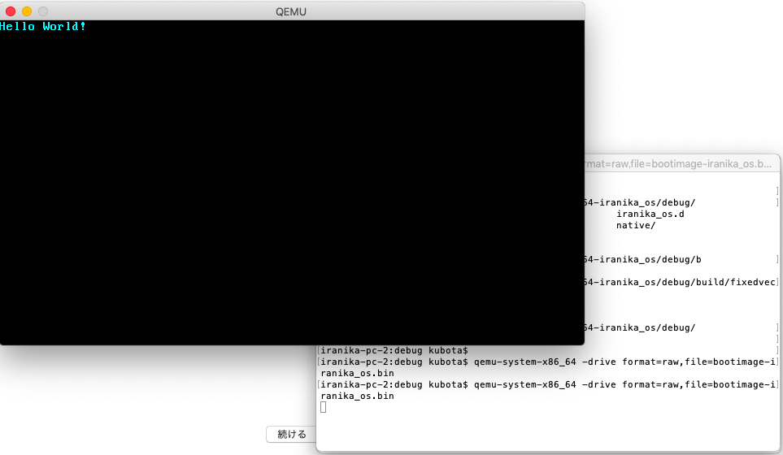

# A Minimal Rust Kernel

この記事では、x86アーキテクチャ用の64bit版Rust kernelをを作る。
僕らが前回作った「独立した自由なRustのバイナリ」をベースに、ブート可能なディスクイメージをビルドするからね。

このブログの内容は[Github](https://github.com/phil-opp/blog_os)で公開しているから、もし何かしらの問題や質問があったらissueを作ってね。あと、このブログの一番下でコメントもできるよ。完成したソースコードは[このポスト](https://github.com/phil-opp/blog_os/tree/post-02)で見つけられるよ。
それじゃあ始めようか。

## The Boot Process

まずはブートプロセス(ブートがいかにして行われるか)について理解を深めなければならない。
僕らがコンピューターの電源を入れると、マザーボードのROMに保存されているファームウェアコードの実行が開始される。
このコードは、電源投入時の自己診断を実行して、使用可能なRAM
(いわゆるメモリ)の検出、そしてCPUとハードウェアの事前初期化を行う。
その後、起動可能なディスクを探し、オペレーティングシステムカーネルの起動を開始する。

x86アーキテクチャでは、２つの標準的なファームウェアがある。
古くからある`Basic Input/Output System`(BIOS)と比較的新しい`Unified Extensible Firmware Interface`(UEFI)だ。
BIOSの規格は古い。だが、シンプルで1980年代以降のすべてのx86マシンならほとんどサポートされているはずだ。
対象的にUEFIは新しく、BIOSと比べてより多くの機能を備えている。それゆえにセットアップがBIOSより複雑だ(個人的感想)

今のところは、BIOSのみをサポートしているが、UEFIのサポートも予定しているので、もし協力してくれる人がいたら[Githubのissue](https://github.com/phil-opp/blog_os/issues/349)をチェックしてくれ。

### BIOS Boot

大体のx86システム(UEFIベースのマシンも含む)は、BIOSでのブートをサポートしている。
これは非常にありがたく、素晴らしいことだ。
だって、何世紀にも渡ってすべてのx86マシンで同じブートロジックを使用できるということだからね。
しかし、このありがたい互換性は同時にBIOSでのブートの最大の弱点でもある。
なぜなら、ブート前にはCPUがリアルモードと呼ばれる16bit互換モードになる必要があり、1980年代の古風なブートローダーを動かさなければならないからだ。

でも僕らは、初心者なのでBIOSブートへの理解を深めよう。

さて、コンピュータの電源を入れると、マザーボードにある特別なフラッシュメモリからBIOSがロードされる。BIOSはハードウェアの自己診断と初期化ルーチンを実行する。
それから、ブート可能なディスクを探す。
探して見つかった場合は、ディスクの先頭に格納されている実行可能な512バイトのコード(ブートローダー)に制御が移譲される。
ほとんどのブートローダーは一般的に、512バイトより大きいので、512バイトに収まる`first stage`と、その後に`first stage`によって呼び出される`second stage`に区分されている。

ブートローダーの役割について少し話す。
ブートローダーはディスク上のカーネルイメージの場所を特定し、それをメモリにロードする必要がある。
また、CPUを16bitのリアルモードから32bitプロテクトモードにして、その後64bitロングモードに切り替える必要がある。
この64bitロングモードでは、64bitレジスタと完全なメインメモリを使用できるようになる。
また、BIOSから特定の情報(メインメモリのマップなど)を照合して、OSのカーネルに渡すのもBIOSの仕事である。

ブートローダーを書くのは、アセンブリ言語を駆使して「この魔法の値をプロセッサレジスタにwriteしよう」といった感じで、深い理解に基づく魔術のような手順を必要とするので少し面倒だ。
したがって、この記事ではブートローダーの作成については説明しない。
代わりに、ブートローダーを自動的にカーネルに追加するbootimageという名前のツールを提供しようと思う。

えっ？
ブートローダーを作ることにも興味があるだって？
しょうがないな…
実は、すでにそのトピックについて記事を書く計画があるから、乞うご期待ってことで。
とりあえず今は、ちいさなRust kernelを作ることに専念しよう。

#### The Multiboot Standard

<!-- not transrate
To avoid that every operating system implements its own bootloader, which is only compatible with a single OS, the Free Software Foundation created an open bootloader standard called Multiboot in 1995. The standard defines an interface between the bootloader and operating system, so that any Multiboot compliant bootloader can load any Multiboot compliant operating system. The reference implementation is GNU GRUB, which is the most popular bootloader for Linux systems.

To make a kernel Multiboot compliant, one just needs to insert a so-called Multiboot header at the beginning of the kernel file. This makes it very easy to boot an OS in GRUB. However, GRUB and the Multiboot standard have some problems too:

They support only the 32-bit protected mode. This means that you still have to do the CPU configuration to switch to the 64-bit long mode.
They are designed to make the bootloader simple instead of the kernel. For example, the kernel needs to be linked with an adjusted default page size, because GRUB can't find the Multiboot header otherwise. Another example is that the boot information, which is passed to the kernel, contains lots of architecture dependent structures instead of providing clean abstractions.
Both GRUB and the Multiboot standard are only sparsely documented.
GRUB needs to be installed on the host system to create a bootable disk image from the kernel file. This makes development on Windows or Mac more difficult.
Because of these drawbacks we decided to not use GRUB or the Multiboot standard. However, we plan to add Multiboot support to our bootimage tool, so that it's possible to load your kernel on a GRUB system too. If you're interested in writing a Multiboot compliant kernel, check out the first edition of this blog series.

 -->

 ### UEFI

<!--
 (We don't provide UEFI support at the moment, but we would love to! If you'd like to help, please tell us in the Github issue.)
-->

 ## A Minimal Kernel

<!-- not transrate
 コンピュータがどのように起動するかがおおまかにわかったので、今度は独自の最小カーネルを作成します。私たちの目標は、起動時に「Hello World！」という画面を表示するディスクイメージを作成することです。そのために、前回の記事からの自立型のRustバイナリをベースにしています。

覚えているかもしれませんが、私たちはcargoを通して自立型のバイナリを構築しましたが、オペレーティングシステムによっては異なるエントリポイント名とコンパイルフラグが必要でした。これは、cargoがデフォルトでホストシステム、つまり実行しているシステム用に構築されているためです。これは私たちのカーネルには望んでいることではありません。 Windowsはあまり意味がありません。代わりに、明確に定義されたターゲットシステム用にコンパイルしたいです。
-->

### Target Specification

<!-- not Translate
Cargoは--targetパラメータを通してさまざまなターゲットシステムをサポートします。ターゲットは、CPUアーキテクチャ、ベンダー、オペレーティングシステム、およびABIを表す、いわゆるターゲットトリプルによって記述されます。たとえば、x86_64-unknown-linux-gnuターゲットトリプルは、x86_64 CPUを搭載したシステム、明確な製造元はない、およびGNU ABIを搭載したLinuxオペレーティングシステムを表しています。 Rustは、Android用のarm-linux-androideabiやWebAssembly用のwasm32-unknown-unknownなど、さまざまなターゲットトリプルをサポートしています。

しかしながら、私たちのターゲットシステムでは、いくつかの特別な設定パラメータ（例えば基礎となるOSがない）を必要とするので、既存のターゲットトリプルはどれも適合しません。幸いなことに、RustではJSONファイルを通して自分自身のターゲットを定義することができます。たとえば、x86_64-unknown-linux-gnuターゲットを記述するJSONファイルは次のようになります。

-->

```json
{
    "llvm-target": "x86_64-unknown-linux-gnu",
    "data-layout": "e-m:e-i64:64-f80:128-n8:16:32:64-S128",
    "arch": "x86_64",
    "target-endian": "little",
    "target-pointer-width": "64",
    "target-c-int-width": "32",
    "os": "linux",
    "executables": true,
    "linker-flavor": "gcc",
    "pre-link-args": ["-m64"],
    "morestack": false
}
```

<!-- not translate
ほとんどのフィールドは、そのプラットフォーム用のコードを生成するためにLLVMによって必要とされます。たとえば、データレイアウトフィールドは、さまざまな整数、浮動小数点、ポインタ型のサイズを定義します。次に、target-pointer-widthなど、Rustが条件付きコンパイルに使用するフィールドがあります。 3番目の種類のフィールドはどのようにクレートを作るべきかを定義します。たとえば、pre-link-argsフィールドは、リンカに渡される引数を指定します。

私達はまた私達のカーネルでx86_64システムをターゲットにしているので、私達のターゲット仕様は上のものと非常に似ているでしょう。まず、共通の内容を含むx86_64-blog_os.jsonファイルを作成します（好きな名前を選択してください）。

-->

```json
{
    "llvm-target": "x86_64-unknown-none",
    "data-layout": "e-m:e-i64:64-f80:128-n8:16:32:64-S128",
    "arch": "x86_64",
    "target-endian": "little",
    "target-pointer-width": "64",
    "target-c-int-width": "32",
    "os": "none",
    "executables": true,
}
```

<!-- not translate
ベアメタルで実行するので、llvm-targetとosフィールドのOSをnoneに変更したことに注意してください。

以下のビルド関連のエントリを追加します。
-->

```js
"linker-flavor": "ld.lld",
"linker": "rust-lld",
```

<!-- not translate
プラットフォームのデフォルトのリンカー（Linuxターゲットをサポートしていない可能性があります）を使用する代わりに、カーネルをリンクするためにRustに同梱されているクロスプラットフォームのLLDリンカーを使用します。
-->

```js
"panic-strategy": "abort",
```
<!--
この設定は、ターゲットがパニック時のスタックの巻き戻しをサポートしていないことを指定します。そのため、プログラムは直接中止する必要があります。これはCargo.tomlのpanic = "abort"オプションと同じ効果があるので、そこから削除できます。
-->

```js
"disable-redzone": true,
```

<!--
カーネルを書いているので、ある時点で割り込みを処理する必要があります。それを安全に行うには、「レッドゾーン」と呼ばれる特定のスタックポインタの最適化を無効にする必要があります。そうしないとスタックが破損する可能性があります。詳細については、レッドゾーンを無効にすることについての別の投稿を参照してください。
-->

```js
"features": "-mmx,-sse,+soft-float",
```

<!--
機能フィールドは、ターゲット機能を有効/無効にします。 mmxとsseの機能にはマイナスを付けて無効にし、soft-float機能にはプラスの接頭辞を付けて有効にします。

mmxおよびsse機能は、多くの場合プログラムを大幅に高速化することができる単一命令複数データ（SIMD）命令のサポートを決定します。ただし、カーネルはハードウェア割り込みごとにそれらをバックアップしなければならないため、大きなSIMDレジスタはOSカーネルでパフォーマンスの問題を引き起こします。これを避けるために、私たちのカーネルではSIMDを無効にしています（トップで実行されているアプリケーションではありません）。

SIMDを無効にすることの問題は、x86_64での浮動小数点演算がデフォルトでSIMDレジスタを必要とすることです。この問題を解決するために、ソフトフロート機能を追加しました。これは、通常の整数に基づくソフトウェア機能を通してすべての浮動小数点演算をエミュレートします。

詳しくは、SIMDの無効化に関する投稿を参照してください。
-->

### Putting it Together
target specification fileは次のようになりました。

```js
{
  "llvm-target": "x86_64-unknown-none",
  "data-layout": "e-m:e-i64:64-f80:128-n8:16:32:64-S128",
  "arch": "x86_64",
  "target-endian": "little",
  "target-pointer-width": "64",
  "target-c-int-width": "32",
  "os": "none",
  "executables": true,
  "linker-flavor": "ld.lld",
  "linker": "rust-lld",
  "panic-strategy": "abort",
  "disable-redzone": true,
  "features": "-mmx,-sse,+soft-float"
}
```

## Building our Kernel

<!--
私たちの新しいターゲットのためにコンパイルすることはLinuxの慣習を使うでしょう（私はなぜ私はそれがちょうどLLVMのデフォルトであると仮定します）。これは、前の記事で説明したように、_startというエントリポイントが必要であることを意味します。
-->

```rs
#![no_std]
#![no_main]
#![feature(panic_implementation)]

use core::panic::PanicInfo;

/// This function is called on panic.
#[panic_implementation]
fn panic(_info: &PanicInfo) -> ! {
    loop {}
}

#[no_mangle] // don't mangle the name of this function
pub extern "C" fn _start() -> ! {
    // this function is the entry point, since the linker looks for a function
    // named `_start` by default
    loop {}
}
```

<!--
ホストOSに関係なく、エントリポイントは_startという名前にする必要があります。前回の投稿のWindowsとmacOSのエントリポイントは削除する必要があります。

JSONファイルの名前を--targetとして渡すことで、新しいターゲット用にカーネルを構築できます。
-->

```
> cargo build --target x86_64-iranika_os.json

error[E0463]: can't find crate for `core`
  |
  = note: the `x86_64-iranika_os-2324288414049030350` target may not be installed
error: aborting due to previous error

For more information about this error, try `rustc --explain E0463`.
error: Could not compile `iranika_os`.
```

<!--
失敗する！このエラーは、Rustコンパイラがコアまたはcompiler_builtinsライブラリを見つけられなくなったことを示しています。両方のライブラリは、すべてのno_stdクレートに暗黙的にリンクされています。コアライブラリにはResult、Option、イテレータなどの基本的なRust型が含まれていますが、compiler_builtinsライブラリには、LLVMで想定されているさまざまな低レベルの関数（memcpyなど）が用意されています。

問題は、コアライブラリがRustコンパイラと一緒にプリコンパイル済みライブラリとして配布されていることです。そのため、サポートされているホストトリプル（x86_64-unknown-linux-gnuなど）にのみ有効ですが、カスタムターゲットには無効です。他のターゲット向けにコードをコンパイルしたい場合は、まずこれらのターゲット向けにcoreを再コンパイルする必要があります。
-->

## Cargo xbuild

ここで、cargo xbuildの登場です。
これは、コアと他の組み込みライブラリを自動的にクロスコンパイルする、cargo buildのラッパーです。以下を実行してインストールできる。

```
cargo install cargo-xbuild
```

このコマンドはrustのソースコードに依存します。
このコードはrustup component add rust-srcでインストールできます。
もし、"error[E0432]: unresolved import `core::ffi::c_void`"とか怒られた場合は、nightlyでのインストールが原因かもしれませんので、新しくターミナルを立ち上げて再度`cargo install cargo-xbuild`インストールを試してください。僕の場合はそれでうまくいきました。

これで、buildの代わりにxbuildを使って上記のコマンドを再実行できます。

```sh
> cargo xbuild --target x86_64-blog_os.json
Compiling iranika_os v0.1.0 (/Users/kubota/code/iranika_os)
    Finished dev [unoptimized + debuginfo] target(s) in 1.15s
```

cargo xbuildのクロスコンパイルが、新しいカスタムターゲット向けに、Core、コンパイラビルトイン、そしてライブラリの割当を行う。
(ちなみにこれらのライブラリは、内部処理で不安定な機能を使用しているため、NightlyバージョンのRustコンパイラでしか動作しません。)
その後、cargo xbuildは僕らのOSクレートを正常にコンパイルします。

これで、ベアメタルターゲット用にkernelを構築できました。
ただし、ブートローダーによって呼び出される`_start`エントリポイントはまだ空白です。なので、スクリーンになにか出力するようにしましょう。


### Printing to Screen

この段階で画面にテキストを印刷する最も簡単な方法は、VGAテキストバッファです。
画面に表示される内容を格納した、VGAハードウェアにマップされた特別なメモリ領域です。
通常は25行で構成され、各業には80文字のセルが含まれています。
各文字のセルは、前面と背面に色を持つASCⅡ文字を表示します。
画面出力は次のようになります。

次の記事でVGAバッファの正確なレイアウトについて説明します。そこで、最初の小さなドライバを作成します。 「Hello World！」を印刷するには、バッファがアドレス0xb8000にあり、各文字セルがASCIIバイトとカラーバイトで構成されていることを知っておく必要があります。

実装は次のようになります。

```rs
static HELLO: &[u8] = b"Hello World!";

#[no_mangle]
pub extern "C" fn _start() -> ! {
    let vga_buffer = 0xb8000 as *mut u8;

    for (i, &byte) in HELLO.iter().enumerate() {
        unsafe {
            *vga_buffer.offset(i as isize * 2) = byte;
            *vga_buffer.offset(i as isize * 2 + 1) = 0xb;
        }
    }

    loop {}
}

```

<!--
まず、整数の0xb8000を生のポインタにキャストします。それから、静的HELLOバイト文字列のバイトを繰り返します。実行変数iを追加で取得するには、enumerateメソッドを使用します。 forループの本体では、offsetメソッドを使用して文字列byteとそれに対応するcolor byteを書き込みます（0xbは淡シアンです）。

すべてのメモリ書き込みについて危険なブロックがあることに注意してください。その理由は、Rustコンパイラは、作成した生のポインタが有効であることを証明できないためです。それらはどこかを指す可能性があり、データ破損を引き起こす可能性があります。これらを安全でないブロックに入れることによって、基本的に、演算が有効であることは絶対に確実であるとコンパイラに伝えています。安全でないブロックがRustの安全性チェックを無効にしないことに注意してください。それはあなたが4つの追加のことをすることを可能にするだけです。

私はこれが私たちがRustで物事をやりたいやり方ではないことを強調したいと思います。安全でないブロック内で生のポインタを扱うときには、めちゃくちゃになりやすいです。たとえば、注意しなければ、バッファの末尾に簡単に書くことができます。

だから我々はできるだけ安全でないの使用を最小限に抑えたいです。さびは私たちに安全な抽象化を作成することによってこれをする能力を与えます。たとえば、安全でないものすべてをカプセル化し、外部からの問題を不可能にすることを不可能にするVGAバッファタイプを作成できます。このようにして、私たちは最低限の量の危険なものだけを必要とし、私たちがメモリの安全性を侵害しないことを確実にすることができます。次の記事では、そのような安全なVGAバッファの抽象化を作成します。

-->

## Createing a Bootimage

<!--
認識できることを実行する実行可能ファイルができたので、今度はそれを起動可能なディスクイメージに変換します。ブートについてのセクションで学んだように、そのためにはブートローダが必要です。それはCPUを初期化し、カーネルをロードします。

独自のプロジェクトである私たち自身のブートローダを書く代わりに、我々はブートローダクレートを使います。このクレートは、Rustとインラインアセンブリだけで、Cに依存しない基本的なBIOSブートローダーを実装します。私たちのカーネルをブートするためにそれを使うために、私たちはそれへの依存関係を加える必要があります：
-->

```
# in Cargo.toml

[dependencies]
bootloader = "0.3.12"
```

Adding the bootloader as dependency is not enough to actually create a bootable disk image. The problem is that we need to combine the bootloader with the kernel after it has been compiled, but cargo has no support for additional build steps after successful compilation (see this issue for more information).

To solve this problem, we created a tool named bootimage that first compiles the kernel and bootloader, and then combines them to create a bootable disk image. To install the tool, execute the following command in your terminal:

```sh
> cargo install bootimage --version "^0.5.0"
```

The ^0.5.0 is a so-called caret requirement, which means "version 0.5.0 or a later compatible version". So if we find a bug and publish version 0.5.1 or 0.5.2, cargo would automatically use the latest version, as long as it is still a version 0.5.x. However, it wouldn't choose version 0.6.0, because it is not considered as compatible. Note that dependencies in your Cargo.toml are caret requirements by default, so the same rules are applied to our bootloader dependency.

After installing the bootimage tool, creating a bootable disk image is as easy as executing:

```sh
> bootimage build --target x86_64-blog_os.json
```

ou see that the tool recompiles your kernel using cargo xbuild, so it will automatically pick up any changes you make. Afterwards it compiles the bootloader, which might take a while. Like all crate dependencies it is only built once and then cached, so subsequent builds will be much faster. Finally, bootimage combines the bootloader and your kernel to a bootable disk image.

After executing the command, you should see a bootable disk image named bootimage-blog_os.bin in your target/x86_64-blog_os/debug directory. You can boot it in a virtual machine or copy it to an USB drive to boot it on real hardware. (Note that this is not a CD image, which have a different format, so burning it to a CD doesn't work).

### How dose it work? 
The bootimage tool performs the following steps behind the scenes:

- It compiles our kernel to an ELF file.
- It compiles the bootloader dependency as a standalone executable.
- It appends the bytes of the kernel ELF file to the bootloader.

When booted, the bootloader reads and parses the appended ELF file. It then maps the program segments to virtual addresses in the page tables, zeroes the .bss section, and sets up a stack. Finally, it reads the entry point address (our _start function) and jumps to it.

### Bootimage Configuration
The bootimage tool can be configured through a [package.metadata.bootimage] table in the Cargo.toml file. We can add a default-target option so that we no longer need to pass the --target argument:

```
# in Cargo.toml
[package.metadata.bootimage]
default-target = "x86_64-blog_os.json"
```

Now we can omit the --target argument and just run bootimage build.

## Booting it!

We can now boot the disk image in a virtual machine. To boot it in QEMU, execute the following command:

```
> qemu-system-x86_64 -drive format=raw,file=bootimage-blog_os.bin
```




Alternatively, you can invoke the run subcommand of the bootimage tool:

```
> bootimage run
```

By default it invokes the exact same QEMU command as above. Additional QEMU options can be passed after a --. For example, bootimage run -- --help will show the QEMU help. It's also possible to change the default command through an run-command key in the package.metadata.bootimage table in the Cargo.toml. For more information see the --help output or the Readme file.

### Real Machine

It is also possible to write it to an USB stick and boot it on a real machine:

```sh
> dd if=target/x86_64-blog_os/debug/bootimage-blog_os.bin of=/dev/sdX && sync
```

Where sdX is the device name of your USB stick. Be careful to choose the correct device name, because everything on that device is overwritten.